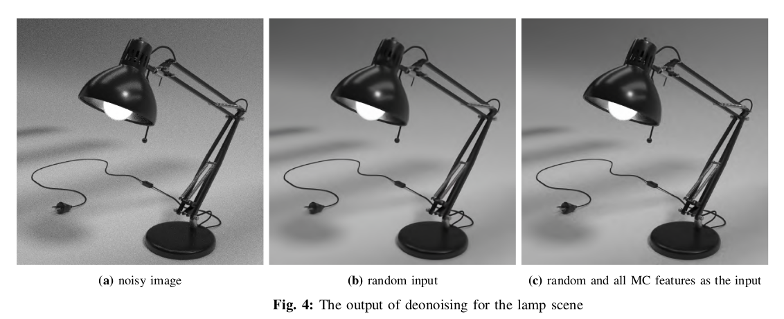
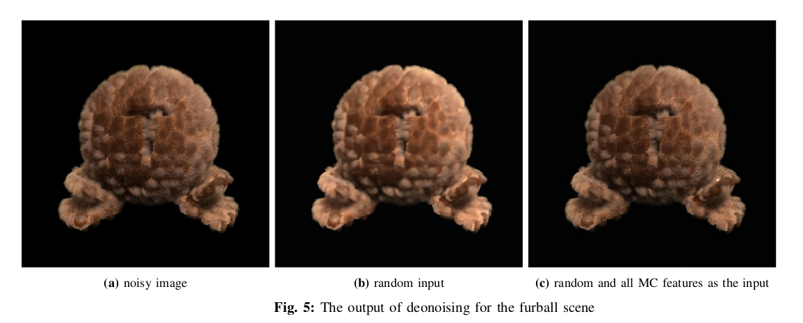
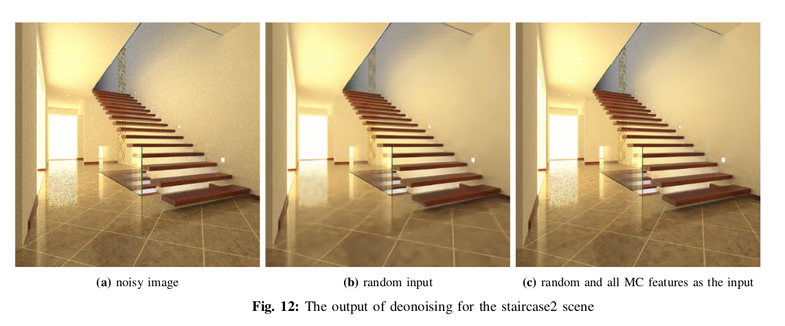

 # Deep Learning Based Denoiser for Images Rendered by Monte Carlo Sampling
 
 Note: The code is forked from https://dmitryulyanov.github.io/deep_image_prior. Please follow the instructions given in the link for installation and details of the code.

In this code, we design a denoiser for images rendered by Monte Carlo sampling, based on the approach introduced in "Deep Image Prior". We build on top of their design a new single image denoiser which works best for denoising the images rendered by Monte Carlo sampling. We try to benefit from additional features provided by Monte Carlo sampling such as normals, depth and etc. to improve the performance of denoiser. Our result show that using the features provided by the MC renderer in addition to a random matrix as the input of the neural networks often improve the quality of the denoised images. Our implementation uses the Monte Carlo features given in https://github.com/tunabrain/tungsten/tree/master/src/denoiser .For more information please refer to the Report.pdf in report file. 

Note: Our implemtation is in the "the MonteCarlo-denoiser.ipynb" script. The denoised results are in the "Results-MonteCarloDenoising" folder.

Note2: You can find the full technical report [here](https://github.com/hsouri/deep-image-prior/blob/master/Report/Report.pdf).

Some putputs:

